<!-- ╔══════════════════════════════════════════════════════════╗
     Profil GitHub — AmDrouin — thème Gruvbox — dynamique
     ══════════════════════════════════════════════════════════ -->

  

<!-- Compteurs — DYNAMIQUE (libellés en ASCII pour éviter les URL cassées) -->

  
  

<!-- Stats + top langages — DYNAMIQUE (instance perso AmDrouin, jamais rate-limitée) -->

  
  

<!-- Serie de contributions — DYNAMIQUE -->

  

<!-- Graphe d'activite — DYNAMIQUE (couleurs gruvbox sur mesure) -->

  

<!-- Trophees — DYNAMIQUE -->

  

  
  
  
  

