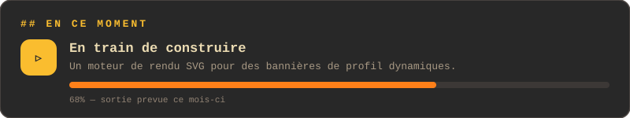
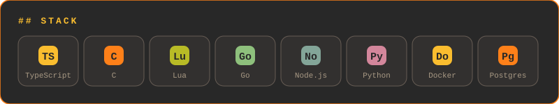
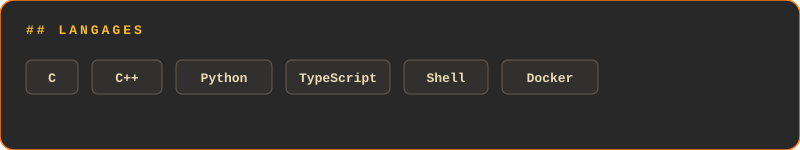

<!-- Profil GitHub — AmDrouin — modules autonomes -->

  

## Profil

- **Reconversion assumée :** après un Master 1 Histoire (Nantes), formation intensive en développement à 42 Angoulême.
- **Recherche active :** alternance RNCP 7 (contrat de professionnalisation, 2 ans) à partir d'avril ou septembre 2026.
- **Terrain solide :** expériences en caisse et intérim multi-secteurs — autonomie, rigueur, gestion des priorités.
- **Mobilité :** basé à Angoulême, disponible sur Avignon prochainement.

  

## Compétences techniques

  

  

- **C** — projets Unix (shell maison, built-ins), algorithmes de graphes (Dinitz), bases du multithreading, bas niveau.
- **C++** — paradigme objet, introduction au protocole TLS (serveur IRC conforme RFC 2812).
- **Python** — traitement de données et scripting (scraping).
- **JavaScript / TypeScript** — sites fonctionnels : base de données, sécurité, responsive, WebSocket, gestion de tokens.
- **Docker / Kubernetes** — conteneurisation de services, introduction à l'orchestration.

## Projets phares

### [Minishell](https://github.com/AmDrouin/Minishell) — C
Reproduction d'un shell Unix : parsing, pipes, redirections et built-ins, sans bibliothèque externe.

### [Ft_IRC](https://github.com/AmDrouin/Ft_IRC) — C++
Serveur IRC conforme à la RFC 2812, développé en C++98 avec gestion bas niveau des sockets et du multiplexage.

### [Judge](https://github.com/AmDrouin/Judge) — TypeScript
Réseau social autour de la critique de films : base de données, authentification par tokens, WebSocket, design responsive.

### [Inception](https://github.com/AmDrouin/Inception) — Shell / Docker
Infrastructure applicative conteneurisée avec Docker, services multi-conteneurs.

## Statistiques GitHub

  
  

  

## Au-delà du code

Passionné de cinématographie — d'où **Judge**, mon projet de réseau social autour de la critique de films — et d'horticulture / bien-être animal.

## Me contacter

- **LinkedIn :** [adrouinn](https://www.linkedin.com/in/adrouinn/)
- **GitHub :** [@AmDrouin](https://github.com/AmDrouin)
- **Email :** [amaury.d.pro@proton.me](mailto:amaury.d.pro@proton.me)
- **Localisation :** Angoulême (16) — Avignon prochainement
